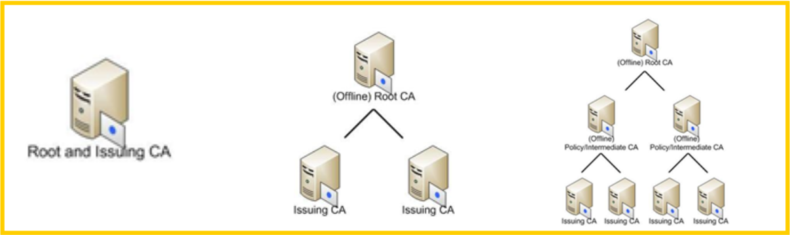

# Designing and Planning

Topics:

- Key Considerations
- Architecture Design
- PKI Security
- CA Configuration
- Active Directory Certificate Services
- Certificate Authority types
- Certificate Templates & Enrollment methods

## Public Key Infrastructure: Key Considerations

Purpose of deploying PKI- There are many security reasons to deploy a PKI:

- Control access to the network with 802.1x authentication
- Approve and authorize applications with Code Signing
- Protect user data with EFS
- Secure network traffic IPSec
- Protect LDAP-based directory queries Secure LDAP
- Implement two-factor authentication with Smart Cards
- Protect traffic to internal web-sites with SSL
- Implement Secure Email

Moreover, many applications support the use of certificates in some capacity, Like:

- Active Directory
- Exchange
- IIS
- Internet Security & Acceleration Server
- Office Communications Server
- Outlook
- System Center Configuration Manager
- Windows Server Update Services

## Costs for implementing a PKI

- Hardware costs: Servers, Hardware Security Modules (HSMs), Backup Devices, Backup Media
- Software costs: Windows Server Licenses 
- Human capital: Paying someone to design, implement, and manage the PKI infrastructure

## Associated Benefits

- Integration: Microsoft CA’s, especially Enterprise CAs, have a tight integration with Microsoft products. The integration makes managing and requesting certificates from Microsoft Operating Systems and applications straight forward.
- Automation: An Enterprise CA is tightly integrated with Active Directory, using autoenrollment, a simple group policy can be configured to automate the deployment of certificates to computers and users.
- Manageability: Server administrators are needed to issue and revoke certificates. they are also required to manage the hardware, apply patches, take backups, publishes Certificate Revocation Lists and manages the CA itself.
- Security: The level of security is going to be determined by the level of risk, While creating PKI security policy, any industry or government regulations are taken into consideration.

-----------------------------------

# Architecture Design

When designing PKI solution you will have to determine the hierarchy that you will use. There are generally three types of hierarchies, and they are denoted by the number of tiers.

- A single-tier CA hierarchy has only one CA that serves as both the Root and Issuing CA. While Root CAs establish trust, Issuing CAs issue certificates to end entities. Though typically separated for security, in this setup they are combined and suitable for simple environments where ease of management and lower cost are prioritized over high security or flexibility. Security can be improved by using an HSM to protect the CA’s keys, though this adds cost and complexity.

- A two-tier PKI hierarchy strikes a balance between simplicity and security. It includes an offline Root CA and one or more online Issuing CAs. Separating these roles improves security, especially since the Root CA’s private key is offline and better protected. It also offers scalability, allowing multiple Issuing CAs across locations or with varied security levels. Though manageability is slightly impacted (as the Root CA must be brought online to sign CRLs), the added cost is minimal and often just the price of a hard drive and OS license. A VM can also serve as a Root CA if stored securely.

- A three-tier hierarchy introduces a second-tier CA between the Root and Issuing CA. This intermediate CA can serve as a Policy CA, controlling what types of certificates Issuing CAs are allowed to issue. It may also act as an administrative boundary, where specific policies or verification steps are followed before certificate issuance, even if not enforced technically. Another reason to include a second-tier CA is to contain the impact of a compromise. If a CA needs to be revoked, it can be done at the second tier without affecting other branches under the Root. Like the Root CA, second-tier CAs can also be kept offline for added security.

## Security

1. Private Key Protection- A key part of PKI design is ensuring strong security controls, especially around protecting the CA’s private key. This key is used to sign certificates and CRLs, and its integrity is essential for trust. In Microsoft CAs, the private key is protected using DPAPI (software-based), but this doesn't prevent local administrators from accessing it, potentially violating the principle of least privilege.

- Offline CA Storage- One method to protect a CA's private key is to keep the CA offline and store its hard drive securely. By limiting when and how the CA is used, the risk of key compromise is significantly reduced.

- Hardware-Based Protection- Another approach is using hardware to secure the key. While smartcards offer a low-cost option, they require being physically connected and offer limited protection. A more secure and widely accepted solution is a Hardware Security Module (HSM), which provides strong, FIPS-compliant protection but comes at a higher cost.

2. Administrative Access Control- Beyond securing the private key, it’s important to manage who can do what on the CA. In smaller setups, one admin may handle everything. But in larger or more secure environments, it’s best to define roles with specific levels of access. Common CA roles include:

- CA or PKI Administrator whose role is to manage the CA itself.
- Certificate Manager who issues and revokes certificates.
- Enrollment Agent is typically a role used in conjunction with smart cards; an Enrollment Agent enrolls for a certificate on behalf of another user.
- Key Recovery Manager if using key archival. If you are using key archival, the Key Recovery Manager is responsible for recovering private keys. Also, if you are using EFS an EFS Recovery Agent role may be created to recover data encrypted using EFS.
- Backup Operator who is responsible for backing up the CA and restoring data in case of failure.
- Auditor who is responsible for reviewing audit logs and ensuring policy is not being violated.

3. Policies and Guidelines- Security requirements for a PKI are usually defined by the organization’s security policy, shaped by regulatory, industry, and internal needs. These policies may also define technical elements like encryption algorithms or CA operations. Before deploying a PKI, CA-specific documents like the Certificate Policy (CP) and Certification Practice Statement (CPS) should be created. The CP details identity verification steps before certificate issuance, while the CPS outlines how the PKI is operated securely. Reviewing public examples of these documents can help when drafting your own.

4. Additional Security Considerations- Ensure all online CAs are regularly updated with the latest security patches. It's also essential to have a reliable anti-malware solution installed to protect against threats.

## CA Configuration

1. Certificate Validity Period- Digital certificates are valid between a set start and end date. The validity period for CA and end-entity certificates should be defined based on your needs. For CAs, it’s set during installation or key renewal. For end-entity certificates, the shortest of the following determines the validity:

- The issuing CA’s remaining lifetime
- The period defined in the certificate template
- A registry setting (as noted in KB254632)

2. Key Length Considerations- Key length directly impacts the security of certificates. You need to define:

- CA Key Lengths – Set during CA installation or renewal. Renewal key size is controlled via the CAPolicy.inf file.
- Issued Certificates – Key size depends on the CSP and can be set in the certificate request or template (for Enterprise CAs).

As a rule, longer certificate lifetimes should use longer key lengths. While 4096-bit keys are recommended for CAs from a security perspective, 2048-bit keys offer better compatibility with devices and applications.

3. AIA (Authority Information Access) Location- When validating a certificate, clients must validate the full chain—from the issuing CA to the Root CA. If they don’t have the full chain locally, they retrieve it from a location called the AIA, which is included in the certificate’s AIA extension. When planning your PKI, consider where your clients are:

- Domain-joined Windows clients (internal): Use LDAP via Active Directory.
- Non-domain or non-Windows internal clients: Use an internal web server.
- External clients: Use a public web-based AIA location. 

4. CDP Locations- A CDP (CRL Distribution Point) is the location where clients download the Certificate Revocation List (CRL) to check if a certificate has been revoked. CRLs list revoked certificate serial numbers, the revocation time, and the reason for revocation. Like AIA locations, plan CDP paths based on the type and location of your clients—internal or external, domain-joined or not—to ensure accessibility.

5. CRL Validity and Overlap Periods- Like certificates, CRLs (Certificate Revocation Lists) have defined validity periods—start and end dates. The appropriate CRL lifetime depends on the CA’s role:

- Offline Root or Policy CAs typically issue few certificates. Their CRLs can have longer lifetimes (e.g., 6–12 months), since revocations are rare.
- Issuing CAs handle many end-entity certificates, making revocations more frequent. Therefore, their CRLs usually have shorter lifetimes—ranging from a few days to even hours. 

Overlap Period- To ensure seamless availability, a new CRL is published before the previous one expires. The overlap period allows both versions to be valid briefly, giving time for replication across all repositories.

6. Delta CRLs- Delta CRLs provide updates on certificates revoked since the last base CRL was published. For example, if Certificate A is revoked, it's listed in the base CRL. If Certificate B is revoked later, a Delta CRL includes just that update. Clients download both the base and Delta CRLs to verify revocation status. This approach helps avoid repeatedly publishing large base CRLs. Delta CRLs are optional and typically not used with offline CAs, since frequent updates aren't possible in that setup.

-------------------------------------------------------

# Microsoft PKI

## Active Directory Certificate Services

Active Directory Certificate Services (AD CS) is a Windows Server role (2016, 2019, 2022 & 2025) for issuing and managing public key infrastructure (PKI) certificates used in secure communication and authentication protocols.

There are three editions of the OS on which you can install the Certificate Authority role. Those editions are Standard, Enterprise, and Datacenter. Standard or Enterprise Editions are normally used.

Windows Server supports four different types of CA:

- Enterprise Root CA
- Enterprise Subordinate CA
- Standalone Root CA
- Standalone Subordinate CA

## Certificate Authority Type

1. Enterprise CA: Tightly integrated with Active Directory, it supports auto-enrollment, smart card sign-in, and uses certificate templates. It leverages AD data to automatically approve or deny requests, making it ideal for managed, domain-based environments. It also allows for computer or user autoenrollment which allows certificate request and issuance to be automated through a Group Policy setting. Enterprise CAs also use certificate templates which allow define what types of certificates a user or computer request from the CA.

2. Standalone CA: Functions without Active Directory and doesn’t use templates. All certificate details must be included in the request, which usually requires manual approval. It’s best suited for isolated systems or environments without AD integration.

A. Root CA: The Root Certification Authority is the top-most CA in a PKI hierarchy. It issues its own self-signed certificate, where the Subject and Issuer fields are identical. Once trusted, its certificate is inherently trusted by all clients. To maximize security, the root CA is often kept offline (known as an Offline Root CA) to prevent compromise, since any breach can invalidate the entire CA chain. It typically only issues certificates to subordinate CAs and forms the foundation of trust across the environment.

B. Subordinate CA: Any CA below the root is a subordinate CA. It receives its certificate from a higher CA, either the Root or another subordinate (called an Intermediate CA). Intermediate CAs (or Policy CAs) help structure the hierarchy by segmenting certificate issuance based on geography, purpose, or assurance levels. Issuing CAs are the final layer that directly issue certificates to users or devices. Subordinate CAs can be configured as either Enterprise or Standalone types, depending on the environment.

## Certificate Templates

Certificate Templates simplify the process of certificate issuance by defining preset configurations that are used to generate certificate requests. When a user initiates a request using a template, the client automatically builds the request based on the template's settings. Templates are essential for autoenrollment, which relies on them to function. They help reduce administrative overhead by eliminating the need for complex tools like certreq.exe and custom configuration files. Stored in Active Directory and replicated across all domain controllers in the forest, certificate templates remain highly available to support all domain-joined clients.

## Certificate Enrollment Methods

Certificate Enrollment can be done in various ways, depending on your needs. In most environments, Autoenrollment is used for bulk or routine certificate distribution. For individual cases, testing, or specific scenarios, manual enrollment or Web Enrollment is commonly used.

- Autoenrollment: Automates certificate issuance for users or computers. To use it, you must configure a certificate template and enable the Autoenrollment setting through Group Policy. After a Group Policy refresh, the system will automatically request a certificate based on the assigned template.
- Manual Enrollment: Manual certificate enrollment can be done in several ways. One option is using the Certificates Management Console to request certificates directly. Alternatively, you can generate a request file using the console and submit it later to the CA. Another method involves using the certreq.exe tool, which can create, submit, and install certificate requests.
- Web Enrollment: Web Enrollment is a web page that can be used to submit requests and download issued certificates from a CA. Web enrollment has typically been used to generate custom requests.
- Application Specific Enrollment: Many Microsoft applications, such as Internet Information Services and Office Communication Server have built in wizards that assist with enrolling for certificates that are used by those applications.
- Network Device Enrollment Service (NDES): NDES is a role that uses the SCEP protocol to allow network devices to enroll for certificates.

## Additional Considerations

- Key Archival and Retrieval: Key Archival allows a CA to securely store the private key linked to a certificate in its database. If needed, a Key Recovery Manager can retrieve this key. Separately, for encrypted files, an EFS Recovery Agent can be set up to recover data protected by the Encrypting File System (EFS).
- Active Directory and Group Policy: Aside from Autoenrollment, Active Directory and Group Policy allow the configuration of PKI related settings for clients. This includes EFS-related configuration, automatically publishing Root CA certificates to the Trusted Root Certification Store on clients, revocation checking configuration, and more.

